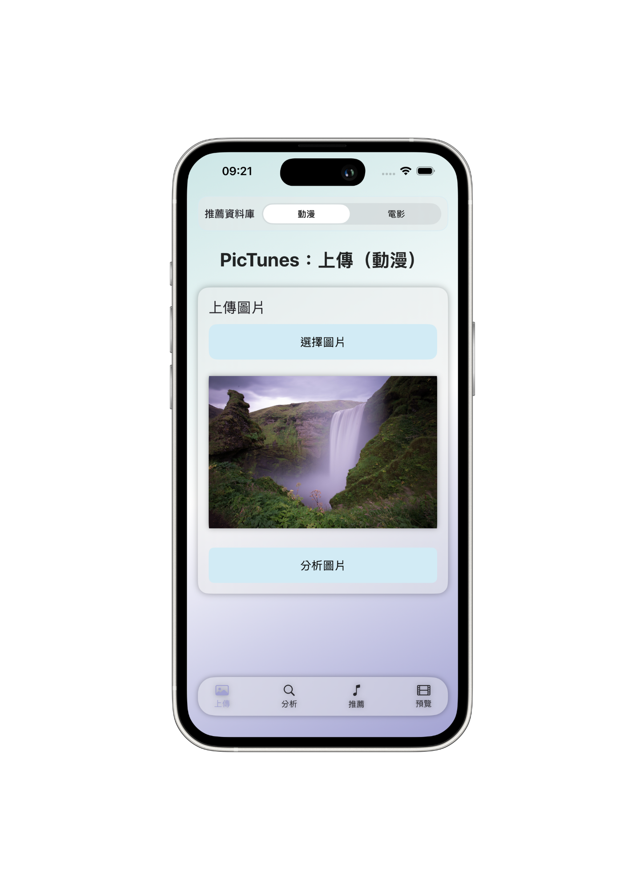
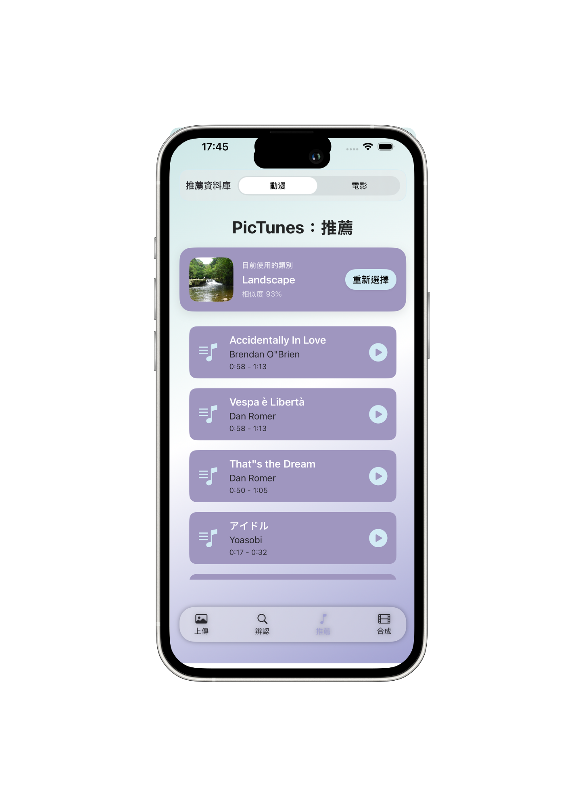
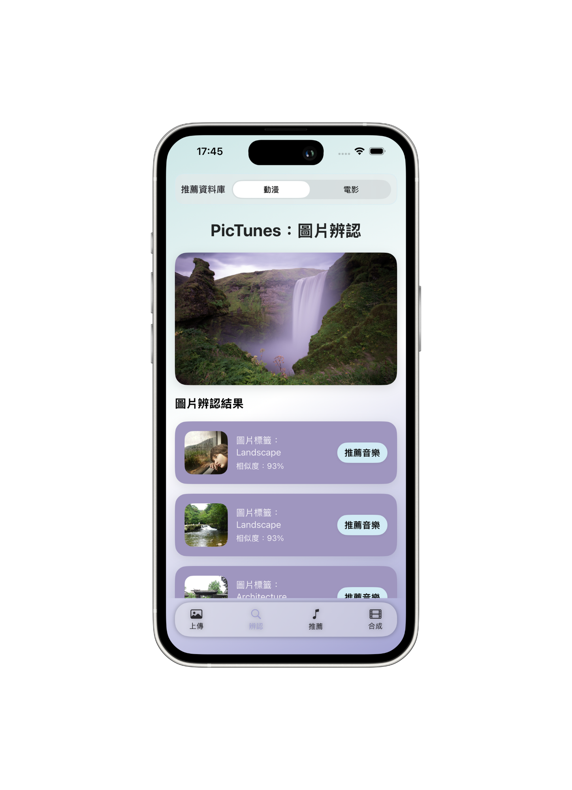
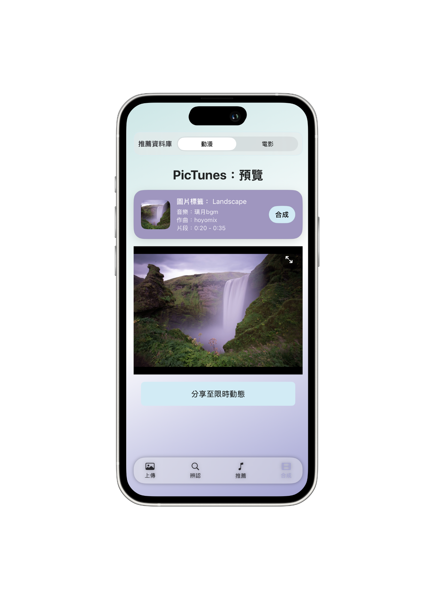

# PicTunesUI

PicTunesUI 是 PicTunes 專題的 iOS 前端應用程式，負責提供使用者上傳圖片、查看圖片辨認結果、瀏覽推薦音樂、預覽合成影片，以及分享至 Instagram 限時動態的完整操作介面。

本專題以「圖片特徵分析為基礎的音樂適配系統」為核心概念，使用者上傳圖片後，前端會將圖片傳送至後端 API，由 SimCLR 模型分析圖片特徵並比對資料庫中的相似圖片，再根據圖片類別與相似度推薦適合的音樂。使用者選擇音樂後，系統可將圖片與音樂片段合成為短影片，並進一步分享到 Instagram Stories。

## Project Overview

PicTunesUI 是整個 PicTunes 系統中的 iOS App 端，主要負責使用者互動流程與前後端資料串接。

系統流程如下：

```text
使用者上傳圖片
        ↓
iOS App 將圖片送至 PicTunes API
        ↓
後端使用 SimCLR 分析圖片特徵
        ↓
回傳相似圖片、圖片類別與推薦音樂
        ↓
使用者選擇推薦音樂
        ↓
後端合成圖片與音樂為短影片
        ↓
iOS App 預覽影片並分享到 Instagram Stories
```

## Features

### Image Upload

使用者可以從相簿選擇圖片，並透過前端介面送出圖片分析請求。

主要功能：

* 使用 PhotosUI 選擇本機圖片
* 顯示使用者已選擇的圖片預覽
* 將圖片以 multipart/form-data 格式傳送至後端 API
* 顯示上傳與辨認狀態

### Image Analysis Result

後端完成圖片分析後，前端會顯示相似圖片與圖片標籤。

主要功能：

* 顯示使用者上傳的圖片
* 顯示後端回傳的相似圖片列表
* 顯示圖片標籤與相似度
* 支援點選相似圖片類別，進入推薦音樂流程

### Music Recommendation

根據圖片辨認結果，前端會顯示推薦音樂清單。

主要功能：

* 顯示推薦音樂名稱
* 顯示作曲家資訊
* 顯示音樂片段起訖時間
* 支援 YouTube 內嵌試聽
* 支援單一音樂播放狀態管理
* 選擇音樂後進入影片合成流程

### Video Preview

使用者選擇音樂後，前端會呼叫後端影片合成 API，並顯示合成後的短影片。

主要功能：

* 顯示已選擇圖片、圖片類別與音樂資訊
* 預覽後端回傳的 MP4 影片
* 支援重新合成影片
* 支援影片分享到 Instagram Stories

### Anime / Film Domain Switch

PicTunesUI 支援兩種推薦資料庫：

* Anime：動漫與動畫配樂資料庫
* Film：電影配樂資料庫

使用者可以在 App 上方切換推薦資料庫，前端會依照使用者選擇的 domain 呼叫後端 API。

### Theme System

前端設計 Anime 與 Film 兩種視覺主題，切換資料庫時會同步改變介面配色。

* Anime 主題：偏明亮、柔和、動畫風格
* Film 主題：偏深色、金色、劇院風格

## Tech Stack

| Category         | Technology                                 |
| ---------------- | ------------------------------------------ |
| Platform         | iOS                                        |
| Language         | Swift                                      |
| UI Framework     | SwiftUI                                    |
| Image Picker     | PhotosUI                                   |
| Video Player     | AVKit / AVPlayer                           |
| YouTube Preview  | YouTube iOS Player Helper / WKWebView      |
| Networking       | URLSession                                 |
| State Management | SwiftUI State / Binding / ObservableObject |
| API Format       | REST API, multipart/form-data              |
| Sharing          | UIPasteboard, Instagram Stories URL Scheme |

## App Screenshots

| Upload                                 | Analysis                                   |
| -------------------------------------- | ------------------------------------------ |
|  |  |

| Recommendation                                         | Preview                                  |
| ------------------------------------------------------ | ---------------------------------------- |
|  |  |

## Repository Structure

```text
PicTunesUI/
├── PicTunesApp.swift
├── ContentView.swift
├── PictunesCore.swift
├── FloatingTabBar.swift
├── UploadSectionView.swift
├── AnalysisSectionView.swift
├── RecommendationSectionView.swift
├── MusicRowView.swift
├── YouTubeInlinePlayerView.swift
├── VideoPreviewPage.swift
├── IGshareButton.swift
└── README.md
```
